# LatihanVCS

Tugas pertemuan ke 4 Bahasa Pemrograman

Nama : Ramadhan Ardi Iman Prakoso

NIM : 312210722

Kelas : TI.22.C.9

Prodi : Teknik Informatika

# Cara Menggunakan Git dan Github:
1.Install git terlebih dahulu(www.git-scm.com)

2.Setelah menginstall Git, Silahkan cek untuk melihat versi Git yang anda install dengan mengetik

git version

3.Anda bisa melakukan login awal pada Git menggunakan Command Prompt (Windows)

4.Selanjutnya, masukkan username GitHub Anda menggunakan perintah di bawah ini. Lalu tekan ENTER jika sudah benar.

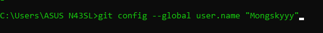

$ git config --global user.name "UsernameAnda"

5.Kemudian masukkan email yang terdaftar di GitHub Anda menggunakan perintah di bawah ini. Lalu tekan ENTER jika sudah benar.

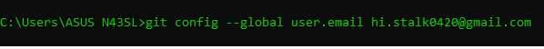

$ git config --global user.email emailanda

6.Selanjutnya untuk memastikan proses login Anda berhasil, masukkan perintah berikut.

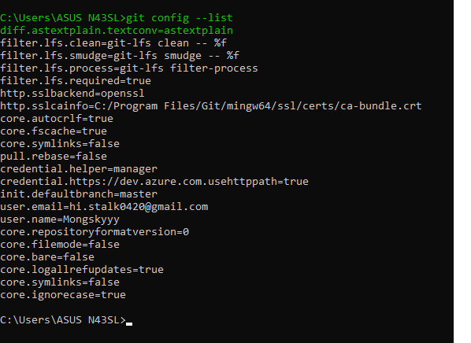

$ git config --list

7.Login ke Github

8.Buat akun terlebih dahulu jika anda baru pertama kali menggunakan Github

9.Setelah berhasil login ke GitHub, Anda bisa mulai membuat repository. Klik tombol New pada menu Repositories untuk membuat repository baru.

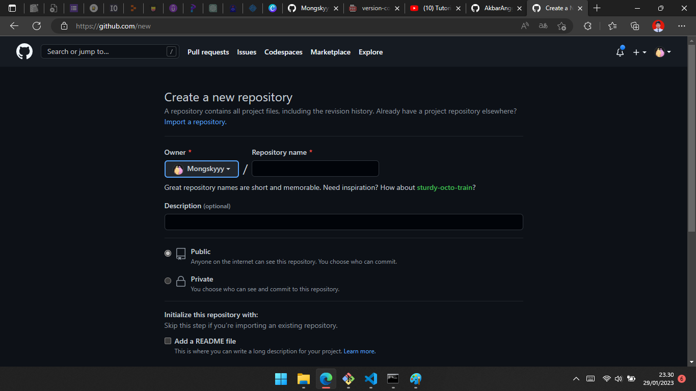

10.Selanjutnya, Anda perlu membuat folder pada local disk komputer Anda. Fungsinya adalah untuk menyimpan update file dari repository GitHub yang telah Anda buat.

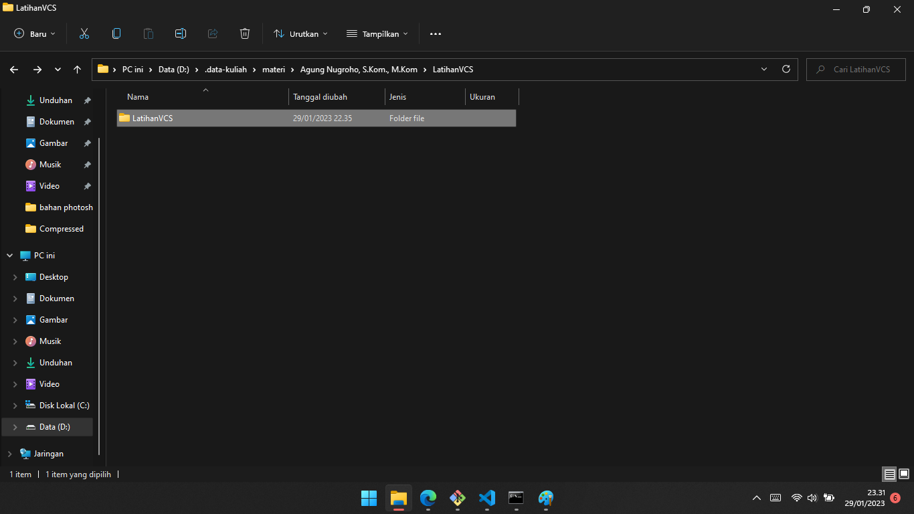

11.Setelah berhasil membuat folder pada local disk komputer Anda, buka folder tersebut dengan cara klik kanan lalu pilih Git Bash Here. Setelah itu, Command Prompt akan muncul seperti di bawah ini.

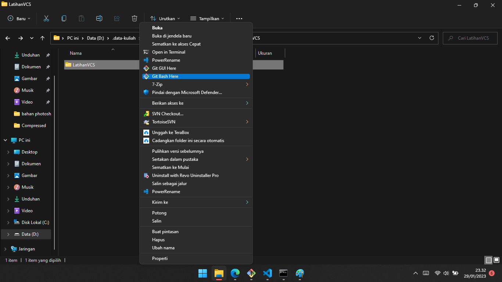

12.Setelah itu, ubah folder tersebut menjadi repository menggunakan perintah berikut

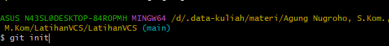

13.Untuk bisa menambahkan file ke repository GitHub, Anda perlu menerapkan langkah-langkah di bawah ini

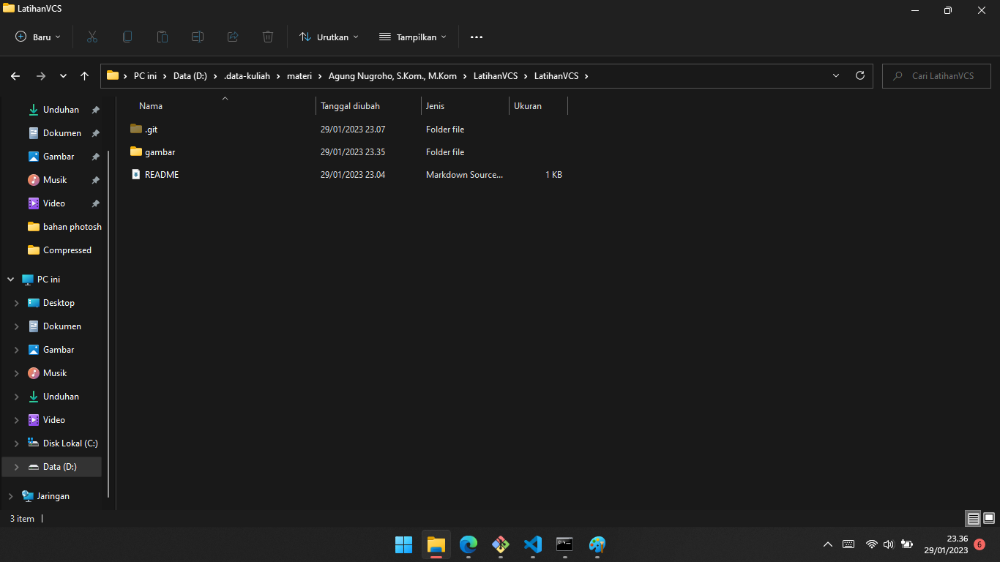

->Buat file di folder yang sudah dibuat (LatihanVCS). Contohnya, di sini kami membuat file README.md

14.Buka GitBash lalu masukkan perintah berikut

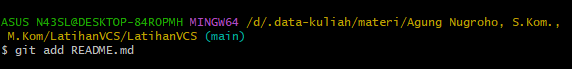

$ git add README.md

15.Lalu setelah itu ketik perintah berikut

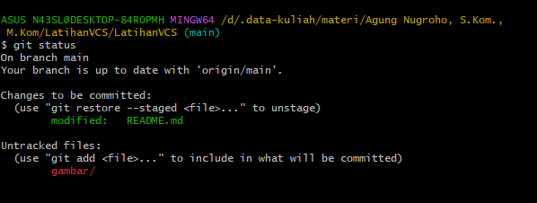

$ git add status

16.Selanjutnya, Anda perlu membuat Commit. Commit berfungsi untuk menambahkan update file serta komentar. Jadi setiap kontributor bisa memberikan konfirmasi update file di proyek yang sedang dikerjakan. Masukkan perintah berikut untuk membuat Commit

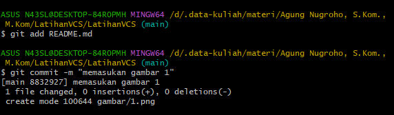

$ git commit -m "komentar perintah"

16.Langkah terakhir adalah push ke GitHub Push ini berfungsi untuk mengupload hasil akhir dari langkah-langkah di atas. Masukkan perintah berikut untuk melakukan push ke GitHub

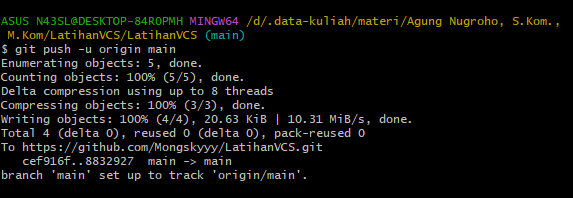

$ git push -u origin main

->Perintah di atas akan menampilkan pop up sign in GitHub. Anda perlu login untuk melanjutkan proses push ke GitHub.

20.Selesai anda sudah berhasil menginstall git juga menggunakan git dan github

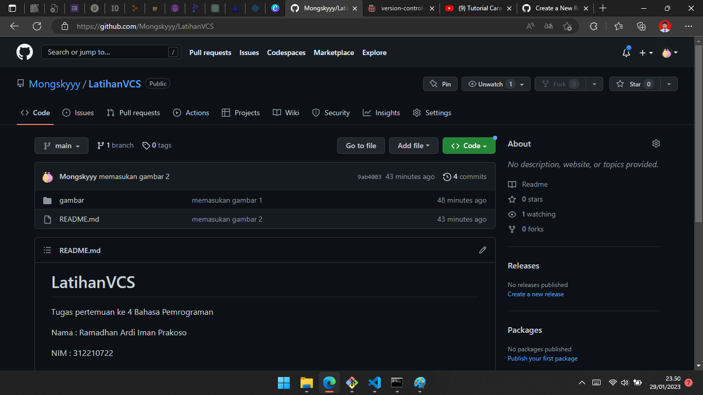