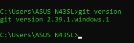

# LatihanVCS

Tugas pertemuan ke 4 Bahasa Pemrograman

Nama : Ramadhan Ardi Iman Prakoso

NIM : 312210722

Kelas : TI.22.C.9

Prodi : Teknik Informatika

# Cara Menggunakan Git dan Github:
1.Install git terlebih dahulu(www.git-scm.com)

2.Setelah menginstall Git, Silahkan cek untuk melihat versi Git yang anda install dengan mengetik

